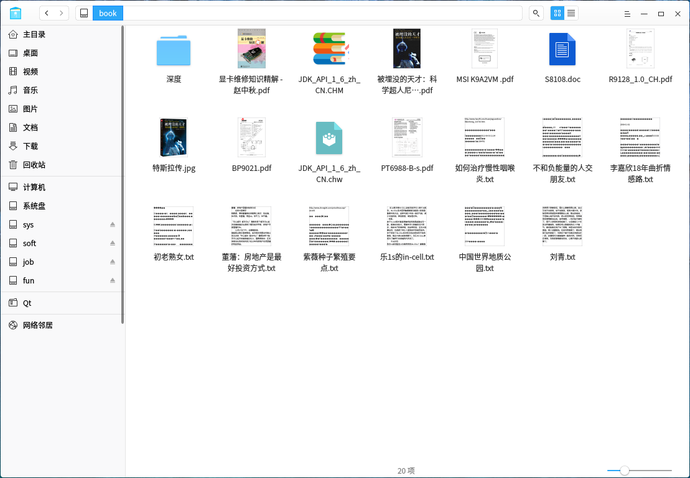
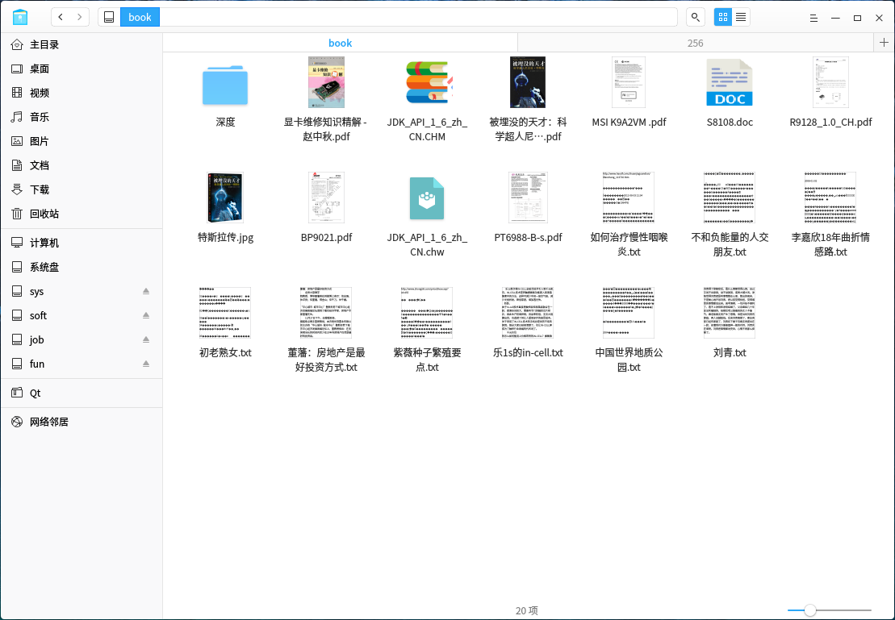
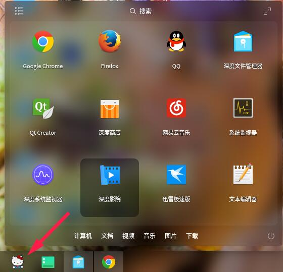
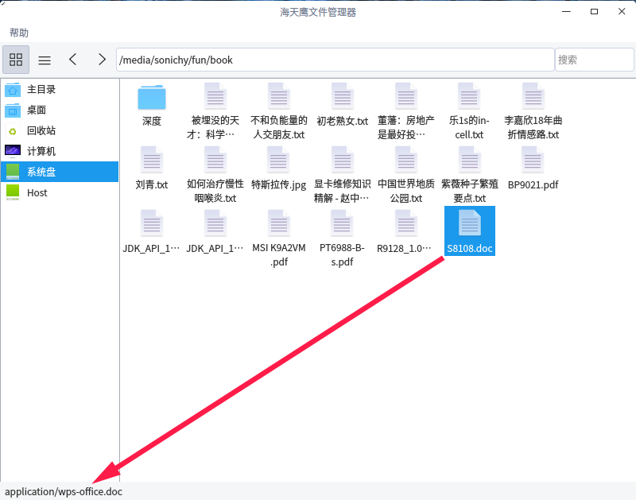

# 如何科学地修改图标主题？
官方图标很好看，但是有几个很辣眼睛。  
叫官方用你的图标？比登天还难，还是自己来改吧。  
到 /usr/share/icons 目录，把自己喜欢的主题目录复制到 /home/用户名/.icons 目录，重命名一下（比如HTY），系统会自动读取这个主题，然后就可以替换了。

### 替换文件图标
替换 mimetypes 文件夹下各个以数字（分辨率）为目录名下以文件MIME命名的图标。  
比如说，我非常讨厌doc文件的图标，替换各分辨率目录下的 application-wps-office.doc.svg（扩展名不重要）

### 替换开始菜单图标
替换 places/256 文件夹下 deepin-launcher.svg（扩展名不重要）

### 如何查看文件的MIME？
海天鹰文件管理器是一个不错的选择：   
